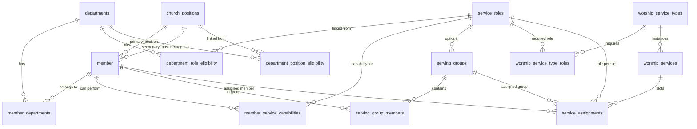

# Organization Module — Database Design

This document describes the database schema for church **organization**, **departments**, **service roles**, **church positions (cargos)**, **serving groups**, and **worship schedules**. It focuses on the data model as implemented in PostgreSQL via TypeORM migrations.

---

## 1. Purpose and scope

The organization module models how a church structures people and worship service planning:

| Concept (UI) | Database | Purpose |
|--------------|----------|---------|
| **Department** | `departments` | Organizational unit (e.g. Media, Treasury, Reception). Can be hierarchical. |
| **Role in department** | `member_departments.role` | Leadership relationship inside a department (Leader / Member / Assistant). **Not** a worship schedule slot. |
| **Service role** | `service_roles` | A function someone performs during worship or church activity (e.g. Sound operator, Reception, Worship leader). Used for eligibility and schedules. |
| **Church position (cargo)** | `church_positions` | Official title held by a member (e.g. Deacon, Deaconess, Collaborator). Stored on the member record. |
| **Serving group** | `serving_groups` | Named team of members, optionally tied to one service role, assignable as a unit on a schedule. |
| **Worship template** | `worship_service_types` | Recurring service pattern (e.g. Sunday morning) with required service roles. |
| **Worship schedule** | `worship_services` | A concrete dated instance of a service with slot assignments. |

These concepts are **intentionally separate**:

- A **deacon** (church position) may serve in **Treasury** (department) as **Leader** (department role) and be eligible for **Reception** (service role) on a schedule only when assigned.
- A **collaborator** (general operational position) may help in many areas; each area is modeled as a **service role**, not as a separate position per task.

---

## 2. High-level entity relationship diagram



---

## 3. Shared conventions

All organization tables extend a common audit pattern (`IdTimestampBaseEntity`):

| Column | Type | Description |
|--------|------|-------------|
| `id` | `SERIAL` | Primary key |
| `created_at` | `TIMESTAMP` | Row creation time |
| `updated_at` | `TIMESTAMP` | Last update time |
| `created_by` | `INTEGER` nullable | User id who created the row |
| `updated_by` | `INTEGER` nullable | User id who last updated the row |

Naming:

- Table names: `snake_case`, plural where appropriate.
- Foreign keys: `{entity}_id` in the database, camelCase in TypeScript entities.
- Junction tables use `@Unique` on the pair of foreign keys to prevent duplicates.
- Parent deletes typically use `ON DELETE CASCADE` on junction rows; member/position references often use `SET NULL` to preserve history.

---

## 4. Departments

### Table: `departments`

Organizational structure. Supports optional parent/child hierarchy.

| Column | Type | Constraints | Description |
|--------|------|-------------|-------------|
| `id` | SERIAL | PK | |
| audit columns | | | See §3 |
| `name` | `VARCHAR` | NOT NULL | Display name |
| `type` | enum | NOT NULL, default `Departamento` | `Departamento` or `Ministério` |
| `description` | `TEXT` | nullable | |
| `parent_id` | `INTEGER` | FK → `departments.id`, `ON DELETE SET NULL` | Optional parent department |
| `is_active` | `BOOLEAN` | NOT NULL, default `true` | Soft disable without delete |

**Enum:** `departments_type_enum` — `Departamento`, `Ministério`

**Migration:** `1781378982046-create-organization-tables.ts`

---

## 5. Member ↔ department membership

### Table: `member_departments`

Links a **member** to a **department** with an internal department role and optional tenure dates.

| Column | Type | Constraints | Description |
|--------|------|-------------|-------------|
| `id` | SERIAL | PK | |
| audit columns | | | |
| `member_id` | `INTEGER` | NOT NULL, FK → `member.id`, CASCADE | |
| `department_id` | `INTEGER` | NOT NULL, FK → `departments.id`, CASCADE | |
| `role` | enum | NOT NULL, default `Membro` | Leader / Member / Assistant |
| `started_at` | `DATE` | nullable | |
| `ended_at` | `DATE` | nullable | End of membership; `NULL` = current |
| `is_active` | `BOOLEAN` | NOT NULL, default `true` | |

**Unique:** `(member_id, department_id)` — one active link row per pair.

**Enum:** `member_departments_role_enum` — `Líder`, `Membro`, `Auxiliar`

This **`role`** is the **function inside the department** (who leads the team), not a worship service role and not a church position.

---

## 6. Service roles

### Table: `service_roles`

Catalog of **service functions** used for capabilities, department eligibility, worship templates, serving groups, and schedule assignments.

| Column | Type | Constraints | Description |
|--------|------|-------------|-------------|
| `id` | SERIAL | PK | |
| audit columns | | | |
| `name` | `VARCHAR` | NOT NULL | e.g. "Recepção", "Operador de som" |
| `category` | enum | NOT NULL | Grouping for admin UI and reporting |
| `description` | `TEXT` | nullable | |
| `is_active` | `BOOLEAN` | NOT NULL, default `true` | |

**Enum:** `service_roles_category_enum`

Initial values (migration `1781378982046`): `Culto`, `Recepção`, `Mídia`, `Geral`

Updated values (migration `1781463632167-update-service-role-category-enum.ts`):

| Value (stored) | Meaning |
|----------------|---------|
| `Direção & Palavra` | Direction & preaching |
| `Louvor` | Worship / music |
| `Mídia & Som` | Media & sound |
| `Recepção` | Reception / hospitality |
| `Apoio & Cuidado` | Support & care |

---

## 7. Department ↔ service role eligibility

### Table: `department_role_eligibility`

Defines which **service roles** are associated with a **department**, and whether membership in that department should **automatically grant** the capability.

| Column | Type | Constraints | Description |
|--------|------|-------------|-------------|
| `id` | SERIAL | PK | |
| audit columns | | | |
| `department_id` | `INTEGER` | NOT NULL, FK → `departments`, CASCADE | |
| `service_role_id` | `INTEGER` | NOT NULL, FK → `service_roles`, CASCADE | |
| `is_default` | `BOOLEAN` | NOT NULL, default `true` | See behavior below |

**Unique:** `(department_id, service_role_id)`

### Semantics of `is_default`

| `is_default` | UI label (PT) | Behavior |
|--------------|-----------------|----------|
| `true` | Atribuir automaticamente | When a member is linked to the department, `EligibilityService` creates/activates a `member_service_capabilities` row with `source = Departamento`. |
| `false` | Optional | Department members are **eligible** for schedule selection (via `getEligibleMembers`) but do **not** receive an automatic capability row. |

Sync is triggered when department eligibility rows are created/updated/deleted, or when department membership changes.

---

## 8. Member service capabilities

### Table: `member_service_capabilities`

Records that a **member can perform** a given **service role**, either manually or via department sync.

| Column | Type | Constraints | Description |
|--------|------|-------------|-------------|
| `id` | SERIAL | PK | |
| audit columns | | | |
| `member_id` | `INTEGER` | NOT NULL, FK → `member`, CASCADE | |
| `service_role_id` | `INTEGER` | NOT NULL, FK → `service_roles`, CASCADE | |
| `source` | enum | NOT NULL, default `Manual` | `Manual` or `Departamento` |
| `is_active` | `BOOLEAN` | NOT NULL, default `true` | |
| `notes` | `TEXT` | nullable | |
| `valid_from` | `DATE` | nullable | Optional validity window |
| `valid_to` | `DATE` | nullable | |

**Unique:** `(member_id, service_role_id)` — one capability record per member/role pair.

**Enum:** `member_service_capabilities_source_enum` — `Manual`, `Departamento`

### Eligibility for schedules

`EligibilityService.getEligibleMembers(serviceRoleId)` returns the union of:

1. Members with an **active** `member_service_capabilities` row for that role, and  
2. Members in any **active** department that has a `department_role_eligibility` row for that role (regardless of `is_default`).

Only active, non-deleted members are included.

---

## 9. Church positions (cargos)

Added in migration `1781553294041-create-church-positions-and-member-position-fks.ts`.

Church positions model **official titles** on a member profile, separate from department roles and service roles.

### Table: `church_positions`

| Column | Type | Constraints | Description |
|--------|------|-------------|-------------|
| `id` | SERIAL | PK | |
| audit columns | | | |
| `name` | `VARCHAR` | NOT NULL | e.g. "Diácono", "Diaconisa", "Colaborador" |
| `category` | enum | NOT NULL, default `Ministerial` | `Ministerial` or `Operacional` |
| `description` | `TEXT` | nullable | |
| `is_active` | `BOOLEAN` | NOT NULL, default `true` | |
| `sort_order` | `INTEGER` | nullable | Optional display ordering |

**Enum:** `church_positions_category_enum` — `Ministerial`, `Operacional`

**Design note:** Gender-specific titles (e.g. Deacon / Deaconess) are modeled as **separate catalog entries**, not as one position with gender rules. Operational generalist titles (e.g. Collaborator) cover members who help across reception, cafeteria, bazaar, parking, etc.; specific tasks remain **service roles**.

### Table: `department_position_eligibility`

Suggests which **church positions** are typical for a department when linking members (admin UI hint). **No automatic sync** to member rows — unlike `department_role_eligibility` → capabilities.

| Column | Type | Constraints | Description |
|--------|------|-------------|-------------|
| `id` | SERIAL | PK | |
| audit columns | | | |
| `department_id` | `INTEGER` | NOT NULL, FK → `departments`, CASCADE | |
| `church_position_id` | `INTEGER` | NOT NULL, FK → `church_positions`, CASCADE | |

**Unique:** `(department_id, church_position_id)`

### Extensions to `member`

| Column | Type | Constraints | Description |
|--------|------|-------------|-------------|
| `primary_position_id` | `INTEGER` | nullable, FK → `church_positions`, SET NULL | Main official title |
| `secondary_position_id` | `INTEGER` | nullable, FK → `church_positions`, SET NULL | Optional second title |

**Validation (application layer):** `primary_position_id` and `secondary_position_id` must differ when both are set.

**Legacy field:** `member.current_position` (`VARCHAR`, free text) is retained for backward compatibility. New UI uses structured FKs; legacy text may still display as fallback.

---

## 10. Serving groups

### Table: `serving_groups`

Named teams that can be assigned to schedule slots as a unit.

| Column | Type | Constraints | Description |
|--------|------|-------------|-------------|
| `id` | SERIAL | PK | |
| audit columns | | | |
| `name` | `VARCHAR` | NOT NULL | |
| `notes` | `TEXT` | nullable | |
| `is_active` | `BOOLEAN` | NOT NULL, default `true` | |
| `service_role_id` | `INTEGER` | nullable, FK → `service_roles`, RESTRICT | Optional binding to one service role |

**Migration for `service_role_id`:** `1781489462462-add-service-role-to-serving-groups.ts`

### Table: `serving_group_members`

| Column | Type | Constraints | Description |
|--------|------|-------------|-------------|
| `id` | SERIAL | PK | |
| audit columns | | | |
| `serving_group_id` | `INTEGER` | NOT NULL, FK → `serving_groups`, CASCADE | |
| `member_id` | `INTEGER` | NOT NULL, FK → `member`, CASCADE | |

**Unique:** `(serving_group_id, member_id)`

---

## 11. Worship templates and schedules

### Table: `worship_service_types`

Template for recurring worship services (“Modelos de Culto”).

| Column | Type | Constraints | Description |
|--------|------|-------------|-------------|
| `id` | SERIAL | PK | |
| audit columns | | | |
| `name` | `VARCHAR` | NOT NULL | |
| `description` | `TEXT` | nullable | |
| `default_weekday` | enum | nullable | Day of week |
| `default_time` | `VARCHAR(5)` | nullable | e.g. `09:00` |
| `is_active` | `BOOLEAN` | NOT NULL, default `true` | |

**Enum:** `worship_service_types_default_weekday_enum` — Portuguese weekday names (`Domingo` … `Sábado`)

### Table: `worship_service_type_roles`

Roles required by a template (how many slots, required or optional, sort order).

| Column | Type | Constraints | Description |
|--------|------|-------------|-------------|
| `id` | SERIAL | PK | |
| audit columns | | | |
| `worship_service_type_id` | `INTEGER` | NOT NULL, FK, CASCADE | |
| `service_role_id` | `INTEGER` | NOT NULL, FK, CASCADE | |
| `quantity` | `INTEGER` | NOT NULL, default `1` | Number of slots |
| `is_required` | `BOOLEAN` | NOT NULL, default `true` | |
| `sort_order` | `INTEGER` | NOT NULL, default `0` | |

**Unique:** `(worship_service_type_id, service_role_id)`

### Table: `worship_services`

A scheduled worship service instance (“Escala”).

| Column | Type | Constraints | Description |
|--------|------|-------------|-------------|
| `id` | SERIAL | PK | |
| audit columns | | | |
| `worship_service_type_id` | `INTEGER` | nullable, FK, SET NULL | Source template |
| `scheduled_at` | `TIMESTAMP` | NOT NULL | Date/time of service |
| `name` | `VARCHAR(255)` | nullable | Override name |
| `status` | enum | NOT NULL, default `Rascunho` | Draft / Published / Completed |
| `notes` | `TEXT` | nullable | |
| `published_by` | `INTEGER` | nullable | User who published |
| `published_at` | `TIMESTAMP` | nullable | |

**Enum:** `worship_services_status_enum` — `Rascunho`, `Publicada`, `Concluída`

### Table: `service_assignments`

One row per **slot** on a worship service: a service role position that can be filled by a member or a serving group.

| Column | Type | Constraints | Description |
|--------|------|-------------|-------------|
| `id` | SERIAL | PK | |
| audit columns | | | |
| `worship_service_id` | `INTEGER` | NOT NULL, FK, CASCADE | |
| `service_role_id` | `INTEGER` | NOT NULL, FK, CASCADE | |
| `slot_number` | `INTEGER` | NOT NULL, default `1` | Supports `quantity > 1` per role |
| `member_id` | `INTEGER` | nullable, FK → `member`, SET NULL | Individual assignee |
| `serving_group_id` | `INTEGER` | nullable, FK → `serving_groups`, SET NULL | Group assignee |
| `status` | enum | NOT NULL, default `Vaga` | See below |
| `assigned_by` | `INTEGER` | nullable | |
| `assigned_at` | `TIMESTAMP` | nullable | |
| `notes` | `TEXT` | nullable | |

**Enum:** `service_assignments_status_enum` — `Vaga`, `Pendente`, `Confirmada`, `Recusada`

**Data migration:** `1781491702988-confirm-assigned-service-slots.ts` sets status to `Confirmada` for rows that had a member or serving group but were still `Pendente`.

A slot is either member-assigned or group-assigned (both FKs nullable until filled).

---

## 12. Concept flow (how tables work together)

```text
┌─────────────────────────────────────────────────────────────────────────┐
│                         MEMBER PROFILE                                   │
│  primary_position_id / secondary_position_id  →  church_positions      │
│  (official title: Deacon, Collaborator, etc.)                            │
└─────────────────────────────────────────────────────────────────────────┘
         │
         │ member_departments (role: Leader / Member / Assistant)
         ▼
┌─────────────────┐     department_role_eligibility      ┌─────────────────┐
│   departments   │ ─────────────────────────────────► │  service_roles  │
└─────────────────┘     (is_default → auto capability)   └─────────────────┘
         │                                                          │
         │ department_position_eligibility (suggestion only)        │
         ▼                                                          ▼
┌─────────────────┐                              member_service_capabilities
│ church_positions│                              (Manual | Departamento)
└─────────────────┘                                          │
                                                               ▼
                                                    eligible for service_assignments
                                                               │
         worship_service_types ──► worship_service_type_roles ──┤
         worship_services ──► service_assignments ◄────────────┘
                                    ▲
                                    │ optional
                              serving_groups
```

---

## 13. Migration history (organization-related)

| Migration | Description |
|-----------|-------------|
| `1781378982046-create-organization-tables.ts` | Core organization schema: departments, service roles, memberships, eligibilities, capabilities, serving groups, worship templates, schedules, assignments |
| `1781463632167-update-service-role-category-enum.ts` | Replaces service role category enum with current five categories |
| `1781489462462-add-service-role-to-serving-groups.ts` | Adds optional `service_role_id` on `serving_groups` |
| `1781491702988-confirm-assigned-service-slots.ts` | Backfills assignment status for filled slots |
| `1781553294041-create-church-positions-and-member-position-fks.ts` | Adds `church_positions`, `department_position_eligibility`, member position FKs |

---

## 14. Permissions (reference)

Organization features are gated by seeded permissions (not stored in organization tables):

| Permission code | Scope |
|-----------------|-------|
| `visualizar_organizacao` | Read organization data |
| `gerenciar_departamentos` | Departments and member–department links |
| `gerenciar_funcoes_servico` | Service roles, capabilities, department role eligibility |
| `gerenciar_cargos_igreja` | Church positions, department position eligibility |
| `gerenciar_escalas` | Create/edit worship schedules |
| `publicar_escalas` | Publish schedules |

On deploy to `main`, CI runs migrations and seeds **permissions + roles only** (`npm run seed:roles-permissions`), so new permission codes are synced without re-seeding users.

---

## 15. Design decisions summary

1. **Three role concepts, three storage patterns**
   - Department role → column on `member_departments`
   - Service role → catalog + capabilities + schedule slots
   - Church position → catalog + FKs on `member`

2. **Department eligibility has two junction tables**
   - `department_role_eligibility` → drives capability sync and schedule eligibility
   - `department_position_eligibility` → UI suggestions only

3. **Capabilities are the bridge to schedules**
   - Manual capabilities: assigned on member edit
   - Department capabilities: synced when `is_default = true`
   - Schedule eligibility also includes all department members for linked roles (even optional ones)

4. **Serving groups vs individuals**
   - `service_assignments` accepts either `member_id` or `serving_group_id` for the same slot model

5. **Legacy compatibility**
   - `member.current_position` free text preserved alongside structured positions

6. **Soft lifecycle**
   - `is_active` flags on catalogs and memberships
   - `ended_at` on department membership for historical separation without deleting rows

---

## 16. TypeORM entity locations

| Table | Entity file |
|-------|-------------|
| `departments` | `src/modules/organization/entities/department.entity.ts` |
| `member_departments` | `src/modules/organization/entities/member-department.entity.ts` |
| `service_roles` | `src/modules/organization/entities/service-role.entity.ts` |
| `department_role_eligibility` | `src/modules/organization/entities/department-role-eligibility.entity.ts` |
| `member_service_capabilities` | `src/modules/organization/entities/member-service-capability.entity.ts` |
| `church_positions` | `src/modules/organization/entities/church-position.entity.ts` |
| `department_position_eligibility` | `src/modules/organization/entities/department-position-eligibility.entity.ts` |
| `serving_groups` | `src/modules/organization/entities/serving-group.entity.ts` |
| `serving_group_members` | `src/modules/organization/entities/serving-group-member.entity.ts` |
| `worship_service_types` | `src/modules/organization/entities/worship-service-type.entity.ts` |
| `worship_service_type_roles` | `src/modules/organization/entities/worship-service-type-role.entity.ts` |
| `worship_services` | `src/modules/organization/entities/worship-service.entity.ts` |
| `service_assignments` | `src/modules/organization/entities/service-assignment.entity.ts` |
| `member` (position FKs) | `src/modules/member/entities/member.entity.ts` |

Business logic for department capability sync and schedule eligibility: `src/modules/organization/eligibility.service.ts`.
